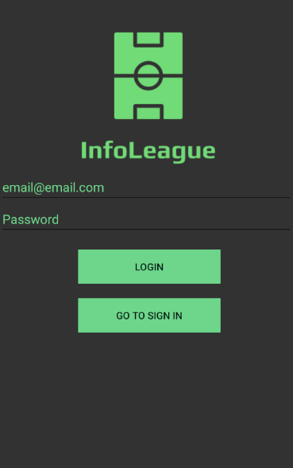
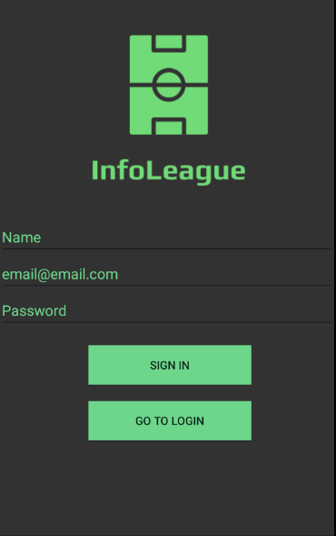
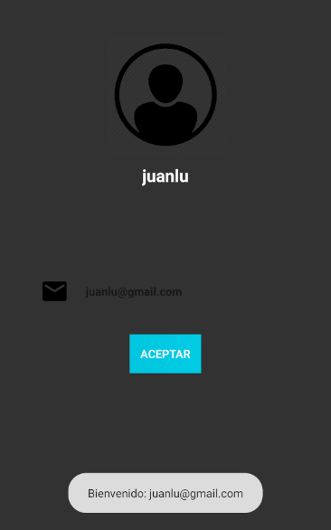
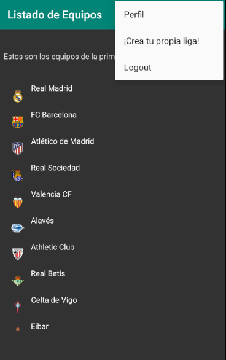
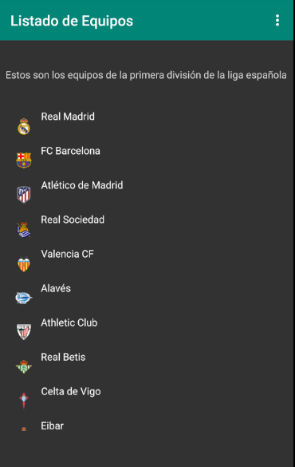
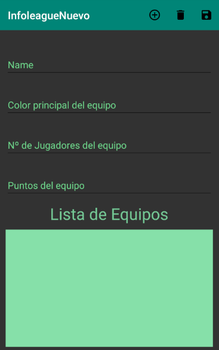

# InfoLeagueAndroid

Proyecto hecho en Android Studio por Juan Luis Aranda Navarro, Alumno de 2º DAM

# Descripción del Proyecto

Este proyecto es una iniciación a Android Studio, por ello que muchas de las funcionalidades que me gustaría que tuviera, no están implementadas todavía.

Esta aplicación esta orientada al mundo deportivo, haciendo referencia a la **Liga Española de Fútbol** concretamente a la *Liga Santander*, que es la **1ª División**.

En ella hemos utilizado un logueo y un registro para administrar los usuarios y posteriormente damos paso al cuerpo de la aplicación.

## Login

Esta aplicación cuenta con un **Login** realizado en **Firebase** para poder diferenciar los distintos usuarios que puedan entrar a la aplicación.

## Sign In

Como es de preever, para realizar un login, previamente debe de haber un **registro** el cual también esta realizado en **Firebase** para que los usuarios se den de alta en la aplicación usando un email y una contraseña.

## Usuario

Esta es la sección del usuario, la cual en un principio solo tenemos una imagen definida por defecto con el nombre del usuario, y el correo electronico de dicho usuario.

Esta es la primera ventana que se abre justo después de hacer el logeo. También viene incluido un **Toast** en la parte inferior de la pantalla dando la bienvenida.

Pulsando en el botón de **Aceptar** se mostrará el resto de la aplicación.

## Navegación - Menú

La navegación de la aplicacion se realiza mediando un menú el cual esta formado por:

- Perfil: Es la pagina de usuario.
- Crea tu propia liga: Es la página donde podrás crear tu propia liga.
- Logout: Pulsando aquí podrás deslogearte de la cuenta con la que accediste a la aplicación.

## Listado de Equipos

Esto sería el cuerpo de la aplicación, en el cual se muestra un listado de todos los equipos.

## Crea tu propia Liga

Aquí podrás añadir diferentes equipos que tu crees para formar tu propia liga.
Cuenta con una serie de inputs con los cuales podrás añadir un equipo a la lista. Una vez pulses el botón superior con el icono MÁS, se lanzará una **notificación** confirmando de que el equipo ha sido añadido.

